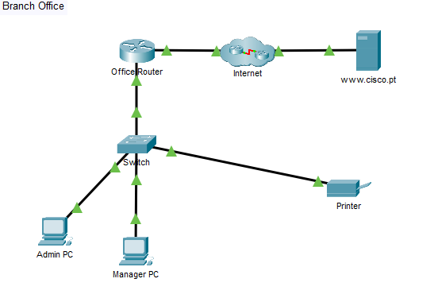

# 🖧 Packet Tracer - Create a LAN

  
*Replace `branch-office-diagram.png` with your uploaded image file name.*

---

## 📋 Addressing Table

| Device       | Interface/Port | IPv4 Address     | Subnet Mask       |
|--------------|----------------|------------------|-------------------|
| **Admin PC** | NIC            | DHCP             | N/A               |
| **Manager PC** | NIC          | DHCP             | N/A               |
| **Printer**  | NIC            | 192.168.1.100    | 255.255.255.0     |
| **www.cisco.pt** | NIC        | 209.165.200.225  | N/A               |

---

## 🎯 Objectives

- Connect network devices and hosts  
- Configure devices with IPv4 addressing  
- Verify end device configuration and connectivity  
- Use networking commands to view host information  

---

## 📖 Background / Scenario

A new branch office is opening, and you need to **set up the LAN**.  
The network devices are in place, but you must:

1. Connect devices and hosts  
2. Configure IPv4 addressing  
3. Verify that local and remote connectivity works  

---

## 🛠️ Instructions

### **Part 1 – Connect Network Devices and Hosts**

**1. Power on devices**
- Open the **Physical Tab** for each device  
- Locate the power switch (switches stay on by default)  
- Turn on devices (green light means powered on)

**2. Connect devices** using this table:

| Device         | Port         | Connected to     | Port         |
|----------------|--------------|------------------|--------------|
| Office Router  | G0/0         | ISP1             | G0/0         |
| Office Router  | G0/1         | Switch           | G0/1         |
| Admin PC       | NIC (F0)     | Switch           | F0/1         |
| Manager PC     | NIC (F0)     | Switch           | F0/2         |
| Printer        | NIC (F0)     | Switch           | F0/24        |

> Use **Ethernet copper straight-through cables** for all LAN connections.  
> Wait for **green link lights** to confirm connectivity.

---

### **Part 2 – Configure IPv4 Addressing**

- **Admin PC** → Set to **DHCP**  
- **Manager PC** → Set to **DHCP**  
- **Printer** → Set **static IP**:
  - IP: `192.168.1.100`  
  - Subnet Mask: `255.255.255.0`  

💡 **Tip:** The PCs will have different IPs but **same subnet mask & gateway** because they are on the same LAN.

---

### **Part 3 – Verify Connectivity**

**1. LAN test**
- On Admin PC → `ping 192.168.1.100` (Printer)  
- On Manager PC → `ping 192.168.1.100`  
- Successful pings = connected and addressed correctly

**2. Internet test**
- Open browser → enter `209.165.200.225` (IP)  
- Then try `www.cisco.pt` (URL)  

❓ If IP works but URL doesn’t → likely a **DNS issue**.

---

### **Part 4 – Use Networking Commands**

**From Command Prompt:**

- `ipconfig` → view basic IP info  
- `ipconfig /all` → view detailed info (DNS, MAC, lease time, etc.)  
- `tracert www.cisco.pt` → see path and routers to destination

---

## 💭 Reflection

In a small office LAN setup like this,  
**biggest facility challenge** = structured cabling & power availability at all device locations.

---
